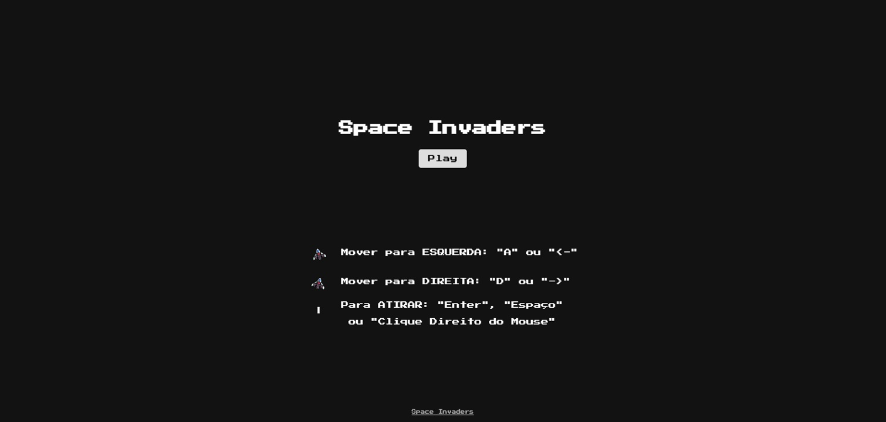
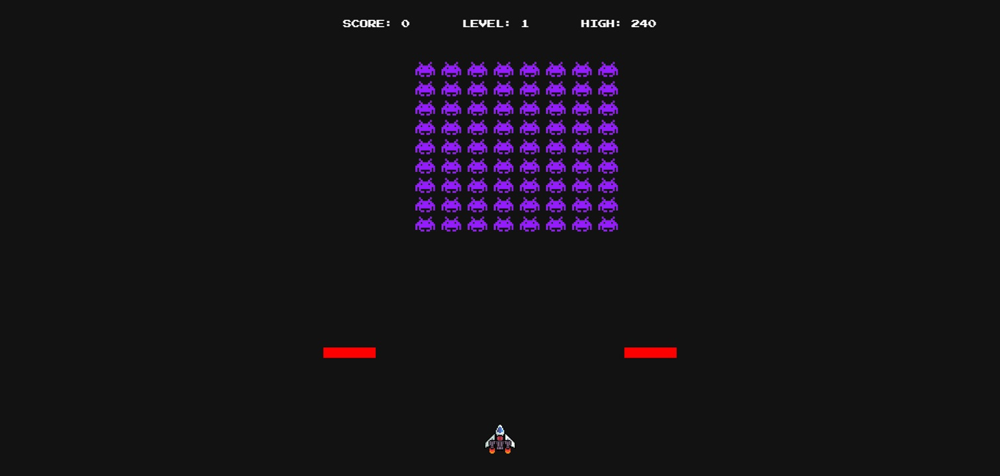
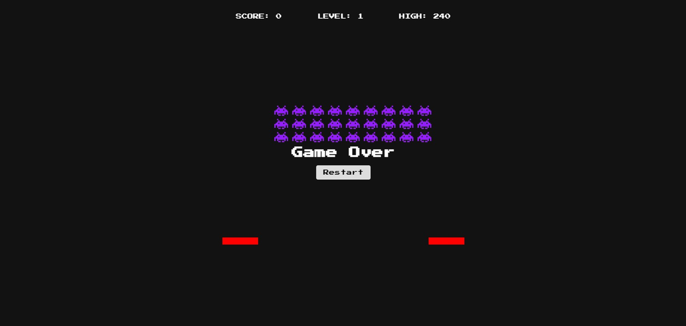

# Space Invader JS

Projeto baseado na playlist de vídeos do canal <b>Manual do Dev</b> do Youtube:
- <a href="https://www.youtube.com/watch?v=RZ3D39UzqZs&list=PLdtmpu_1ITQLMiPRtuAZEN8BpRvMiFa_r" class="blank">Playlist Youtube</a> 

Repositorio do projeto original:
- <a href="https://github.com/manualdodev/space-invaders" class="blank">Repositório Github</a>  

### Diferenças ao projeto inicial
- High Score agora sendo guardado no localStorage;
- Informação de New Record na tela de Game Over, quando o jogar conseguir bater record atual;
- Comentário com uma explicação simples de cada função;
- Inclusão do botão das setas esquerda e direita para movimentação;
- Inclusão do botão do Espaço e do botão do clique direito do mouse para tiro;

### Para o futuro
- Tentar integrar com joystyck padrão Microsoft/PC/XBOX;
- Tentar integrar com Mobile; 

### Telas

    

        
        Tela Inicial
    

    

        
        Tela do Jogo
    

    

        
        Tela de Fim de Jogo
    

